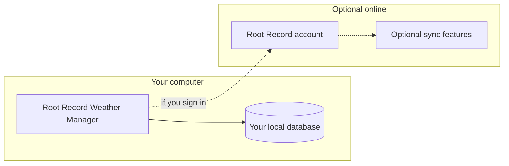

> **Root Record Weather Manager** — overview, download link, and what is new each release. Download the Windows installer from **[Releases](https://github.com/RootRecord/rootrecord-weather-manager-download/releases)** (the `.exe` is posted there with each version).

---

# Root Record Weather Manager

**One calm desktop window for weather, alerts, earthquakes, and hazard context for the places you care about - built for people who want clarity without juggling a dozen browser tabs.**

Current release: **1.0.17** (see **About** in the app for the exact build on your device.)

**What is new in 1.0.17:** Version line for the next published installer and in-app update metadata. See **[CHANGELOG](CHANGELOG.md)**. **What is new in 1.0.16:** **GitHub auto-updates** — the installed app **checks Releases on a schedule** (not only once after launch), and **About → Check for updates…** runs the same flow. **Guest mode** shows a **red banner** when you are not signed in; **live public hazard refreshes** are **capped for guests** (sign in for full cadence). **Windows** uses a stable **App User Model ID** and **native icon** loading so the **taskbar** matches your branded `.ico`. **`npm start` / `npm run dev`** auto-run **`prepare:icon`** so a placeholder icon exists when no brand asset is in the tree. **Signed** installers use **Authenticode** when published that way. **Your locations, history, and database stay on your machine**; use **Releases** for the installer and in-app updates.

**[Download the Windows installer (latest release)](https://github.com/RootRecord/rootrecord-weather-manager-download/releases/latest)**

[Website](https://rootrecord.com/) | [Terms](https://rootrecord.info/terms) | [Privacy](https://rootrecord.info/privacy) | [Contact](https://rootrecord.info/contact)

---

## Table of contents

1. [Why Root Record](#why-root-record)
2. [Who it is for](#who-it-is-for)
3. [At a glance](#at-a-glance)
4. [How your data works](#how-your-data-works)
5. [Feature tour](#feature-tour)
6. [Account, billing, and optional online services](#account-billing-and-optional-online-services)
7. [Privacy & security](#privacy--security)
8. [System requirements](#system-requirements)
9. [Getting started](#getting-started)
10. [FAQ](#faq)
11. [Support](#support)
12. [Changelog](#changelog)
13. [For maintainers (releases)](#for-maintainers-releases)

---

## Why Root Record

Staying ahead of **weather**, **alerts**, and **natural hazards** means pulling information from many sources. Most people end up with a row of browser tabs, each with a different map, a different list, and a different refresh rhythm.

**Root Record Weather Manager** brings those signals into a **single, fast Windows desktop application** that:

- **Centers on your locations** - name and save the places that matter; forecasts and hazard views follow those coordinates instead of a generic default city.
- **Keeps useful history on your machine** - scroll back, compare, and work from what you already retrieved without starting from zero every session.
- **Surfaces what matters** - U.S. and Canada weather alerts, earthquake and tsunami feeds where configured, radar and satellite imagery, and optional hazard context layers with sensible links to authoritative sources.
- **Treats online features as optional** — you can **continue without signing in** for a **free local** session (with clear limits on cloud and some live refresh behavior), or sign in for plan features such as **stronger alerts**, **custom sounds**, and **Root Record cloud** alignment where your tier allows it.

For **step-by-step** help that matches the buttons on screen, open **About** and **Settings** in the app.

---

## Who it is for

| Audience | What you get |
|----------|----------------------|
| **Homeowners and families** | Watch weather and hazards for home, school, and relatives' towns in one place. |
| **People in alert-heavy regions** | Scan U.S. and Canada weather alerts with geography tied to your saved locations. |
| **Earthquake- and tsunami-aware users** | Follow public earthquake feeds and tsunami information in layouts tuned for quick reading. |
| **Operators who prefer the desktop** | One install, one window, local data - not another pinned tab farm. |

---

## At a glance

| | Capability |
|---|------------|
| **Saved locations** | Add and name places on a map; forecasts and many hazard views respect those coordinates. |
| **Weather alerts** | Active alerts for the United States and Canada, filtered toward your geography where applicable. |
| **Earthquakes & tsunamis** | Public feeds and clear layouts for scanning magnitude, region, and timing. |
| **Forecasts & imagery** | Points, observations, satellite stills, and radar-style loops where configured. |
| **Broader hazard context** | Optional layers (for example wildfires and tropical systems) with links out to authoritative sources. |
| **Backups** | Local database backups when you use the app's backup tools - treat exported files like any important document. |
| **Updates** | Installed builds check **GitHub Releases** (`RootRecord/rootrecord-weather-manager-download`) via **electron-updater**; you choose when to download and restart. |

---

## How your data works

Your **saved locations, preferences, and local database** live under **your Windows user profile** in a dedicated **Root Record** folder (the app can show you the path in **About**). That design means:

- **You own the folder** - back it up before reinstalling Windows or moving PCs.
- **You stay useful when connectivity drops** - history you already stored stays readable; live maps and feeds need a network path.
- **Optional online services are exactly that - optional** - sign-in ties into Root Record licensing and optional sync-style features when you use them; they are not required for core public-data monitoring.

**Optional sync** (when signed in and available for your plan) exchanges **supported** updates with your account. It is **not** a substitute for keeping your own **file backups** of the local database.

---

## Feature tour

### Locations and maps

Pick **where** the app should care: save one or more locations, name them, and use the map to stay oriented. Many views key off those coordinates so you are not limited to a single preset city.

---

### Alerts and hazards

Review **active weather alerts** for the U.S. and Canada, **earthquake** activity from public feeds, and **tsunami** information where provided - arranged so you can scan quickly when minutes matter.

---

### Forecasts and imagery

Step through **forecasts**, **observations**, and **imagery** (including satellite and radar-style loops) from **Settings** and the main layout.

---

### Account-linked extras

On supported tiers, sign-in can unlock **stronger alert behavior** (for example critical pop-ups) and **custom alert sounds**. **Your plan and what is included** are always shown **in the app**.

---

## Account, billing, and optional online services

- **Free local use** — You may **open the app without a Root Record account** (guest). The sign-in screen returns on each launch until you sign in. **Cloud sync / backup** through Root Record stays **off** for guests; **live public-data refresh** is **rate-limited** compared to signed-in use.
- **Sign-in** links this installation to your **Root Record account** when you want account-backed features and billing.
- **Billing** follows Root Record's secure flows when you upgrade or manage a plan.
- **Optional sync** (when available for your account) keeps supported record types aligned across devices you sign in on — see in-app messaging for scope.

If billing needs attention, the app explains what is limited until you update payment — without hiding your local history.

---

## Privacy & security

| Topic | What you should know |
|-------|----------------------|
| **Primary storage** | Your database and preferences stay on your PC under your profile unless you or IT redirect them. |
| **Saved locations** | Names and coordinates you enter are stored for your use on device. Account-related flows use HTTPS when you sign in or use online features. |
| **Backups** | Files you export or snapshot land where **you** save them - treat them like sensitive personal data. |

For policies governing websites and online services, see **[Privacy](https://rootrecord.info/privacy)** and **[Terms](https://rootrecord.info/terms)**.

---

## System requirements

| | Minimum guidance |
|---|------------------|
| **Operating system** | **Windows 10 or later**, **64-bit (x64)**. The installer linked on **Releases** is built for **64-bit Windows**. |
| **Display** | **1280×720** or larger recommended; the interface is optimized for modern widescreen laptops and room for maps beside panels. |
| **Disk** | Modest install footprint; allow generous free space for local history, imagery cache behavior, and **backups**. |
| **Network** | Required for live maps, imagery, and public data feeds; optional features need connectivity when you choose to use them. |

---

## Getting started

1. **Install** from the **[latest GitHub release](https://github.com/RootRecord/rootrecord-weather-manager-download/releases/latest)** (Windows `.exe` installer) or your IT-provided package.
2. **Open the app** and complete **first-run setup** - add and **save at least one location** before expecting live data (the app waits until you do so it knows **which places you care about**).
3. **Review About and Settings** for coverage notes, critical alert behavior, radius, units, backup options, and **Check for updates…** (installed builds).
4. **Optional** — Sign in with your Root Record account for Pro-tier alerts/sounds and account-backed features; or stay in **guest** mode for a restricted free local session.

---

## FAQ

**Why is nothing loading yet?**  
Finish setup and **save at least one location**. Until then, the app does not load live weather and hazard feeds.

**Does Root Record sell my saved locations?**  
No. They are stored for **your** use on device. Only flows you start (such as sign-in or optional online features) communicate with Root Record servers.

**Can I back up my data?**  
Yes. Use the app's **backup** tools and copy your data folder when migrating machines - see **About** for the folder location.

**Do I need a subscription?**  
Core monitoring works without one. Some **alert and sound** behaviors are tied to paid tiers — the UI states what is included.

**What does “Continue without signing in” mean?**  
You get a **free local** session: your data stays on the PC, but **Root Record cloud sync/backup** is off, **Pro-only** controls stay locked, and **live hazard API refresh** is **throttled** (guests). Sign in from **Settings** when you want the full experience.

**How do updates work?**  
The **installed** app reads **`resources/app-update.yml`** and checks **GitHub Releases** for your repo’s **`latest.yml`** + installer. You are prompted to **download**, then **restart** — same pattern as RootRecord Business Manager. Development launches (`npm start`) do not auto-update from GitHub.

---

## Changelog

Version-by-version notes: **[CHANGELOG.md](./CHANGELOG.md)**.

---

## For maintainers (releases)

**Git:** **[rootrecord-weather-manager-download](https://github.com/RootRecord/rootrecord-weather-manager-download)** is a **Releases-only** public repo: it has a short README, **not** the application source, and it must not be the **`git remote` for this project.** Keep your full app in a **private** repository; publish installers with **`gh release create`** (or the Release UI) to the download org repo, which does **not** get a `git push` of the tree. **Do not** add build output: **`release/`** (NSIS, `win-unpacked`, on-disk `latest.yml`), **`dist/`**, and **`node_modules/`** are **`.gitignore`d** here and must never be the bulk of a commit to any remote.

Full checklist, **`gh release create`**, and **v1.0.17** copy-paste notes: **[docs/RELEASE.md](./docs/RELEASE.md)** and **[docs/github/](./docs/github/)** (e.g. **[RELEASE_v1.0.17.md](./docs/github/RELEASE_v1.0.17.md)**).

Official channel: **[github.com/RootRecord/rootrecord-weather-manager-download/releases](https://github.com/RootRecord/rootrecord-weather-manager-download/releases)** (`latest.yml` + **`Root Record Weather Manager-Setup-{version}.exe`** must match checksums **electron-updater** expects).

| Step | Command / artifact |
|------|---------------------|
| 1. Prep assets | **`npm run prepare:assets`** (icons, NSIS art, notification sounds) |
| 2. NSIS build | **`npm run build:installer`** → output under **`release/`** (see `package.json` → `build.directories.output`) |
| 3. Sign (optional but recommended for public) | **`npm run build:installer:signed`** — uses **vendored** **`build/sign_release_azure.ps1`**; see **[docs/SIGNING-TRUSTED-AZURE.md](./docs/SIGNING-TRUSTED-AZURE.md)** |
| 4. **`latest.yml`** | **`npm run latest-yml`** — (re)generates **`release/latest.yml`** for the **final** Setup `.exe` (required after signing; must match bytes you upload) |
| 5. Publish | Upload the **Setup `.exe`** and **`latest.yml`** to **[rootrecord-weather-manager-download](https://github.com/RootRecord/rootrecord-weather-manager-download) Releases** tagged **`v{version}`** (see **[docs/RELEASE.md](./docs/RELEASE.md)**; v1.0.17: **[docs/github/RELEASE_v1.0.17.md](./docs/github/RELEASE_v1.0.17.md)**). Ensure `build/app-update.yml` **owner/repo** still matches. |

**In-app updater:** `build/app-update.yml` is copied beside the packaged app as **`resources/app-update.yml`**. **`RR_DISABLE_AUTO_UPDATE=1`**, **`--no-update-check`**, or a **Microsoft Store–style** install path disables GitHub checks.

**Development:** **`npm start`** / **`npm run dev`** run **`prepare:icon`** via **`prestart`** / **`predev`** so a favicon exists for local runs.

**Private full source (team):** use a **separate, private** GitHub repository for **this** app (all files except ignored build/deps) — not the public [rootrecord-weather-manager-download](https://github.com/RootRecord/rootrecord-weather-manager-download) org. Setup and a tree map: **[docs/PRIVATE-GITHUB-REPOSITORY.md](./docs/PRIVATE-GITHUB-REPOSITORY.md)** and **[docs/REPOSITORY-MAP.md](./docs/REPOSITORY-MAP.md)**; **[docs/README.md](./docs/README.md)** lists all internal docs.

---

## Support

- **Product website:** [https://rootrecord.com/](https://rootrecord.com/)
- **Contact:** [https://rootrecord.info/contact](https://rootrecord.info/contact)
- **Terms:** [https://rootrecord.info/terms](https://rootrecord.info/terms)
- **Privacy:** [https://rootrecord.info/privacy](https://rootrecord.info/privacy)

For **how-to** steps that match what you see on screen, use **About** and in-app help where available.

---

© RootRecord. All rights reserved.  
*Root Record Weather Manager* | **v1.0.17**

